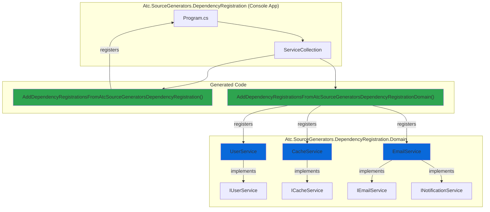
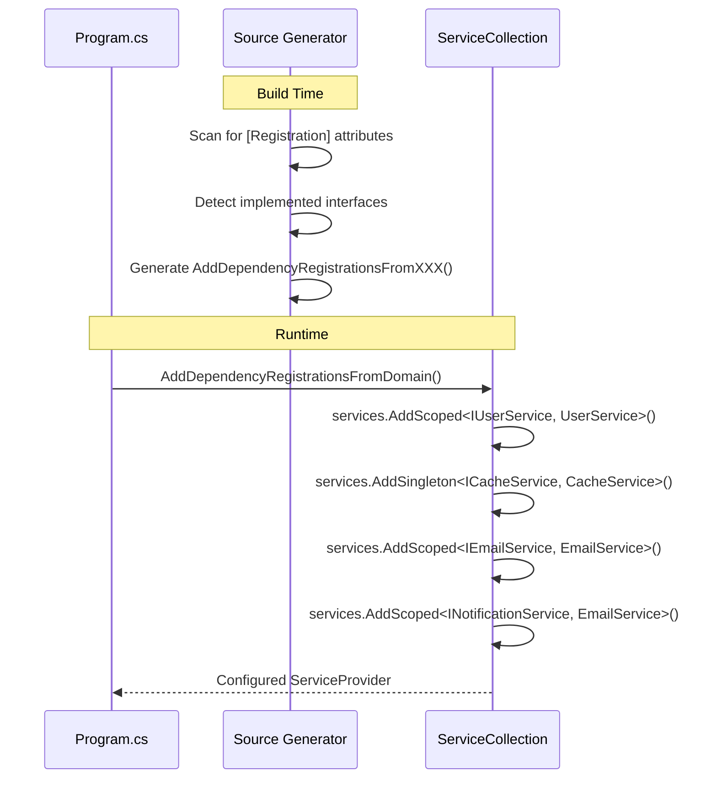

# Dependency Registration Sample

## 🎯 Focus

This sample demonstrates the **DependencyRegistrationGenerator** in a multi-project setup with layered architecture. The focus is on:

- **Zero boilerplate DI registration** across multiple projects
- **Auto-detection** of implemented interfaces
- **Multi-interface support** for services implementing multiple contracts
- **Assembly-specific extension methods** for clean project separation
- **Lifetime management** (Singleton, Scoped, Transient)

## 📁 Sample Projects

- **Atc.SourceGenerators.DependencyRegistration** - Console application (entry point)
- **Atc.SourceGenerators.DependencyRegistration.Domain** - Domain layer with services

## 🏗️ Architecture



## 🔄 Registration Flow



## 💻 Code Example

### Domain Layer Services

```csharp
using Atc.DependencyInjection;

namespace Atc.SourceGenerators.DependencyRegistration.Domain;

// Auto-detected as IUserService
[Registration(Lifetime.Scoped)]
public class UserService : IUserService
{
    public void CreateUser(string name)
    {
        Console.WriteLine($"Creating user: {name}");
    }
}

// Auto-detected as ICacheService
[Registration] // Defaults to Singleton
public class CacheService : ICacheService
{
    public void Set(string key, object value)
    {
        Console.WriteLine($"Caching {key}");
    }
}

// Multi-interface example - registers against BOTH interfaces
[Registration(Lifetime.Scoped)]
public class EmailService : IEmailService, INotificationService
{
    public void SendEmail(string to, string subject)
    {
        Console.WriteLine($"Email to {to}: {subject}");
    }

    public void Notify(string message)
    {
        Console.WriteLine($"Notification: {message}");
    }
}
```

### Application Setup

**Option 1 - Manual Registration:**

```csharp
using Atc.DependencyInjection;
using Microsoft.Extensions.DependencyInjection;

var services = new ServiceCollection();

// One line per project - that's it!
services.AddDependencyRegistrationsFromAtcSourceGeneratorsDependencyRegistration();
services.AddDependencyRegistrationsFromAtcSourceGeneratorsDependencyRegistrationDomain();

var provider = services.BuildServiceProvider();

// Resolve and use services
var userService = provider.GetRequiredService<IUserService>();
userService.CreateUser("John Doe");

var emailService = provider.GetRequiredService<IEmailService>();
emailService.SendEmail("john@example.com", "Welcome");

// Same instance via second interface!
var notifier = provider.GetRequiredService<INotificationService>();
notifier.Notify("System is ready");
```

**Option 2 - Transitive Registration (Recommended):**

```csharp
using Atc.DependencyInjection;
using Microsoft.Extensions.DependencyInjection;

var services = new ServiceCollection();

// Single call automatically registers both projects!
services.AddDependencyRegistrationsFromAtcSourceGeneratorsDependencyRegistration(includeReferencedAssemblies: true);

var provider = services.BuildServiceProvider();

// All services available, including from Domain layer
var userService = provider.GetRequiredService<IUserService>();
userService.CreateUser("John Doe");

var emailService = provider.GetRequiredService<IEmailService>();
emailService.SendEmail("john@example.com", "Welcome");

// Same instance via second interface!
var notifier = provider.GetRequiredService<INotificationService>();
notifier.Notify("System is ready");
```

**All Available Overloads:**

```csharp
// Overload 1: Default (no transitive registration)
services.AddDependencyRegistrationsFromYourProject();

// Overload 2: Auto-detect ALL referenced assemblies recursively
services.AddDependencyRegistrationsFromYourProject(includeReferencedAssemblies: true);

// Overload 3: Register specific referenced assembly (short or full name)
services.AddDependencyRegistrationsFromYourProject("Domain");
services.AddDependencyRegistrationsFromYourProject("MyApp.Domain");

// Overload 4: Register multiple specific assemblies
services.AddDependencyRegistrationsFromYourProject("Domain", "DataAccess", "Infrastructure");
```

## 📝 Generated Code

The generator creates this extension method in each project:

```csharp
// <auto-generated />
namespace Atc.DependencyInjection;

public static class ServiceCollectionExtensions
{
    public static IServiceCollection AddDependencyRegistrationsFromAtcSourceGeneratorsDependencyRegistrationDomain(
        this IServiceCollection services)
    {
        services.AddScoped<IUserService, UserService>();
        services.AddSingleton<ICacheService, CacheService>();
        services.AddScoped<IEmailService, EmailService>();
        services.AddScoped<INotificationService, EmailService>();

        return services;
    }
}
```

## ✨ Key Takeaways

1. **Zero Configuration**: Services are automatically registered against all implemented interfaces
2. **Type Safety**: Compile-time errors if interfaces don't match or lifetimes conflict
3. **Multi-Project**: Each project gets its own `AddDependencyRegistrationsFromXXX()` method
4. **Multi-Interface**: One service can be registered against multiple interfaces automatically
5. **Smart Filtering**: System interfaces (IDisposable, etc.) are automatically excluded

## 🔗 Related Documentation

- [DependencyRegistration Generator Guide](DependencyRegistrationGenerators.md) - Full generator documentation
- [Mapping Sample](ObjectMappingGenerators-Samples.md) - Object mapping example
- [OptionsBinding Sample](OptionsBinding-Samples.md) - Configuration binding example
- [PetStore API Sample](PetStoreApi-Samples.md) - Complete application using all generators
