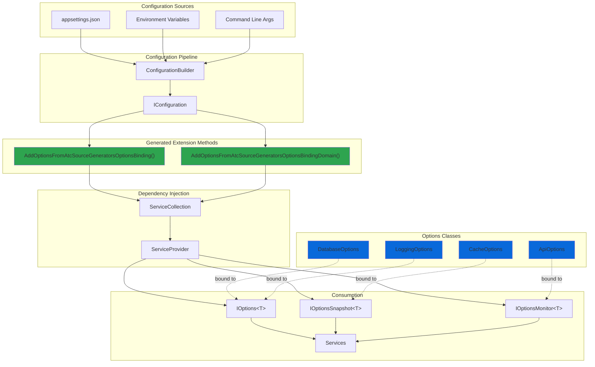
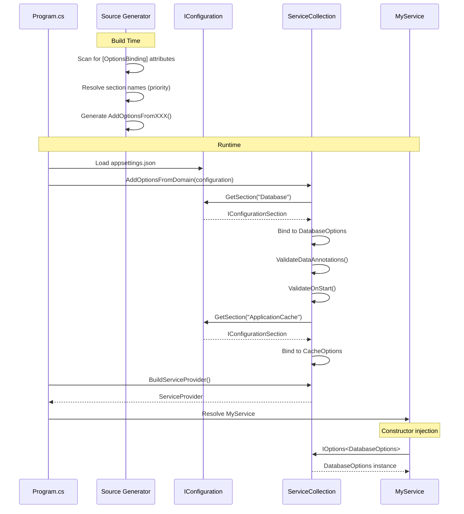

# Options Binding Sample

## 🎯 Focus

This sample demonstrates the **OptionsBindingGenerator** in a multi-project console application with configuration management. The focus is on:

- **Zero boilerplate configuration binding** across multiple projects
- **Automatic section name inference** from class names
- **Type-safe configuration** with validation
- **Multiple configuration sources** (appsettings.json, environment variables)
- **Options lifetime management** (IOptions, IOptionsSnapshot, IOptionsMonitor)
- **Validation at startup** with Data Annotations

## 📁 Sample Projects

- **Atc.SourceGenerators.OptionsBinding** - Console application (entry point)
- **Atc.SourceGenerators.OptionsBinding.Domain** - Domain layer with options classes

## 🏗️ Architecture



## 🔄 Binding Flow



## 💻 Code Example

### Configuration File (appsettings.json)

```json
{
  "Database": {
    "ConnectionString": "Server=localhost;Database=MyApp;",
    "MaxRetries": 3,
    "CommandTimeout": 30
  },
  "ApplicationCache": {
    "MaxSize": 1000,
    "ExpirationMinutes": 60,
    "SlidingExpiration": true
  },
  "App": {
    "Api": {
      "BaseUrl": "https://api.example.com",
      "Timeout": 30,
      "MaxRetries": 3
    }
  },
  "Logging": {
    "Level": "Information",
    "IncludeScopes": true
  }
}
```

### Domain Layer Options

```csharp
using Atc.SourceGenerators.Annotations;
using System.ComponentModel.DataAnnotations;

namespace Atc.SourceGenerators.OptionsBinding.Domain;

// Explicit section name (highest priority)
[OptionsBinding("Database", ValidateDataAnnotations = true, ValidateOnStart = true)]
public partial class DatabaseOptions
{
    [Required]
    [MinLength(10)]
    public string ConnectionString { get; set; } = string.Empty;

    [Range(1, 10)]
    public int MaxRetries { get; set; } = 3;

    [Range(1, 300)]
    public int CommandTimeout { get; set; } = 30;
}

// Using const SectionName (2nd priority)
[OptionsBinding(ValidateDataAnnotations = true)]
public partial class CacheOptions
{
    public const string SectionName = "ApplicationCache";

    [Range(100, 10000)]
    public int MaxSize { get; set; } = 1000;

    [Range(1, 1440)]
    public int ExpirationMinutes { get; set; } = 60;

    public bool SlidingExpiration { get; set; }
}

// Nested section path
[OptionsBinding("App:Api")]
public partial class ApiOptions
{
    [Required]
    [Url]
    public string BaseUrl { get; set; } = string.Empty;

    [Range(1, 300)]
    public int Timeout { get; set; } = 30;

    public int MaxRetries { get; set; } = 3;
}

// Auto-inferred section name from class name (lowest priority)
// Binds to "Logging" section
[OptionsBinding(ValidateOnStart = true, Lifetime = OptionsLifetime.Monitor)]
public partial class LoggingOptions
{
    public string Level { get; set; } = "Information";
    public bool IncludeScopes { get; set; }
}
```

### Application Setup

**Option 1 - Manual Registration:**

```csharp
using Atc.DependencyInjection;
using Atc.SourceGenerators.Annotations;
using Microsoft.Extensions.Configuration;
using Microsoft.Extensions.DependencyInjection;
using Microsoft.Extensions.Options;

// Build configuration
var configuration = new ConfigurationBuilder()
    .SetBasePath(Directory.GetCurrentDirectory())
    .AddJsonFile("appsettings.json", optional: false)
    .AddEnvironmentVariables()
    .Build();

var services = new ServiceCollection();

// One line per project - that's it!
services.AddOptionsFromAtcSourceGeneratorsOptionsBinding(configuration);
services.AddOptionsFromAtcSourceGeneratorsOptionsBindingDomain(configuration);

// Register your services
services.AddSingleton<MyDatabaseService>();
services.AddScoped<MyCacheService>();

var provider = services.BuildServiceProvider();

// Options are validated at startup due to ValidateOnStart = true
// If validation fails, this will throw
```

**Option 2 - Transitive Registration (Recommended):**

```csharp
using Atc.DependencyInjection;
using Atc.SourceGenerators.Annotations;
using Microsoft.Extensions.Configuration;
using Microsoft.Extensions.DependencyInjection;
using Microsoft.Extensions.Options;

// Build configuration
var configuration = new ConfigurationBuilder()
    .SetBasePath(Directory.GetCurrentDirectory())
    .AddJsonFile("appsettings.json", optional: false)
    .AddEnvironmentVariables()
    .Build();

var services = new ServiceCollection();

// Single call automatically registers options from both projects!
services.AddOptionsFromAtcSourceGeneratorsOptionsBinding(configuration, includeReferencedAssemblies: true);

// Register your services
services.AddSingleton<MyDatabaseService>();
services.AddScoped<MyCacheService>();

var provider = services.BuildServiceProvider();

// Options are validated at startup due to ValidateOnStart = true
// If validation fails, this will throw
```

**All Available Overloads:**

```csharp
// Overload 1: Default (no transitive registration)
services.AddOptionsFromYourProject(configuration);

// Overload 2: Auto-detect ALL referenced assemblies recursively
services.AddOptionsFromYourProject(configuration, includeReferencedAssemblies: true);

// Overload 3: Register specific referenced assembly (short or full name)
services.AddOptionsFromYourProject(configuration, "Domain");
services.AddOptionsFromYourProject(configuration, "MyApp.Domain");

// Overload 4: Register multiple specific assemblies
services.AddOptionsFromYourProject(configuration, "Domain", "DataAccess", "Infrastructure");
```

### Service Consumption

```csharp
using Microsoft.Extensions.Options;

// Singleton service with IOptions<T> (best for singleton lifetime)
public class MyDatabaseService
{
    private readonly DatabaseOptions _options;

    public MyDatabaseService(IOptions<DatabaseOptions> options)
    {
        _options = options.Value;
        Console.WriteLine($"DB: {_options.ConnectionString}");
    }
}

// Scoped service with IOptionsSnapshot<T> (reloads per request)
public class MyCacheService
{
    private readonly CacheOptions _options;

    public MyCacheService(IOptionsSnapshot<CacheOptions> options)
    {
        _options = options.Value;
        Console.WriteLine($"Cache max size: {_options.MaxSize}");
    }
}

// Service with IOptionsMonitor<T> (live reload support)
public class MyLoggingService
{
    private readonly IOptionsMonitor<LoggingOptions> _monitor;

    public MyLoggingService(IOptionsMonitor<LoggingOptions> monitor)
    {
        _monitor = monitor;

        // React to configuration changes
        _monitor.OnChange(options =>
        {
            Console.WriteLine($"Logging level changed to: {options.Level}");
        });
    }

    public void Log(string message)
    {
        var currentOptions = _monitor.CurrentValue;
        Console.WriteLine($"[{currentOptions.Level}] {message}");
    }
}
```

## 📝 Generated Code

The generator creates this extension method in each project:

```csharp
// <auto-generated />
namespace Atc.SourceGenerators.Annotations;

public static class ServiceCollectionExtensions
{
    public static IServiceCollection AddOptionsFromAtcSourceGeneratorsOptionsBindingDomain(
        this IServiceCollection services,
        IConfiguration configuration)
    {
        // DatabaseOptions - explicit section name
        services.AddOptions<DatabaseOptions>()
            .Bind(configuration.GetSection("Database"))
            .ValidateDataAnnotations()
            .ValidateOnStart();

        // CacheOptions - const SectionName
        services.AddOptions<CacheOptions>()
            .Bind(configuration.GetSection("ApplicationCache"))
            .ValidateDataAnnotations();

        // ApiOptions - nested section path
        services.AddOptions<ApiOptions>()
            .Bind(configuration.GetSection("App:Api"));

        // LoggingOptions - auto-inferred name + Monitor lifetime
        services.Configure<LoggingOptions>(
            configuration.GetSection("Logging"));
        services.AddSingleton<IOptionsChangeTokenSource<LoggingOptions>>(
            new ConfigurationChangeTokenSource<LoggingOptions>(
                configuration.GetSection("Logging")));

        return services;
    }
}
```

## ✨ Section Name Resolution Priority

The generator resolves section names in this order:

1. **Explicit constructor parameter**: `[OptionsBinding("Database")]` → `"Database"`
2. **`const string SectionName`**: Binds to the value of this constant
3. **`const string NameTitle`**: Fallback if SectionName doesn't exist
4. **`const string Name`**: Fallback if NameTitle doesn't exist
5. **Auto-inferred from class name**: `LoggingOptions` → `"Logging"` (removes "Options" suffix)

### Example

```csharp
[OptionsBinding]  // Explicit parameter wins if provided
public partial class MyOptions
{
    public const string SectionName = "Section1";  // 2nd priority - USED
    public const string NameTitle = "Section2";    // 3rd priority
    public const string Name = "Section3";         // 4th priority
    // Auto-inferred would be "My" (5th priority)
}
// Binds to "Section1"
```

## 🎯 Options Lifetime Comparison

| Lifetime | Interface | Use Case | Reload Behavior |
|----------|-----------|----------|----------------|
| **Singleton** | `IOptions<T>` | Static configuration that never changes | No reload |
| **Scoped** | `IOptionsSnapshot<T>` | Per-request configuration (web apps) | Reloads per scope |
| **Monitor** | `IOptionsMonitor<T>` | Real-time configuration changes | Live reload with notifications |

### When to Use Each

```csharp
// Singleton - For services that don't need config updates
[OptionsBinding(Lifetime = OptionsLifetime.Singleton)]
public partial class DatabaseOptions { }
// Inject: IOptions<DatabaseOptions>

// Scoped - For web apps that need fresh config per request
[OptionsBinding(Lifetime = OptionsLifetime.Scoped)]
public partial class FeatureFlags { }
// Inject: IOptionsSnapshot<FeatureFlags>

// Monitor - For services that need real-time updates
[OptionsBinding(Lifetime = OptionsLifetime.Monitor)]
public partial class LoggingOptions { }
// Inject: IOptionsMonitor<LoggingOptions>
```

## ✨ Key Takeaways

1. **Zero Boilerplate**: No manual `AddOptions().Bind()` code to write
2. **Auto-Inference**: Section names can be inferred from class names
3. **Validation**: Built-in support for Data Annotations validation
4. **Type Safety**: Compile-time errors if configuration doesn't match
5. **Multi-Project**: Each project gets its own `AddOptionsFromXXX()` method
6. **Flexible Lifetimes**: Choose between Singleton, Scoped, or Monitor
7. **Startup Validation**: Catch configuration errors before runtime

## 🔗 Related Documentation

- [OptionsBinding Generator Guide](OptionsBindingGenerators.md) - Full generator documentation
- [DependencyRegistration Sample](DependencyRegistrationGenerators-Samples.md) - DI registration example
- [Mapping Sample](ObjectMappingGenerators-Samples.md) - Object mapping example
- [PetStore API Sample](PetStoreApi-Samples.md) - Complete application using all generators
