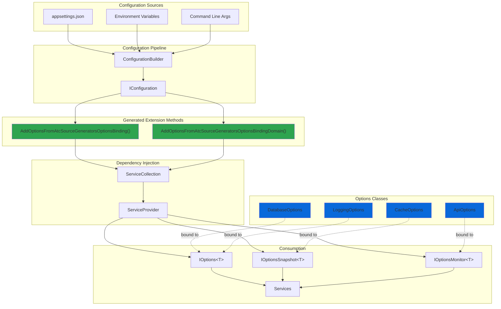
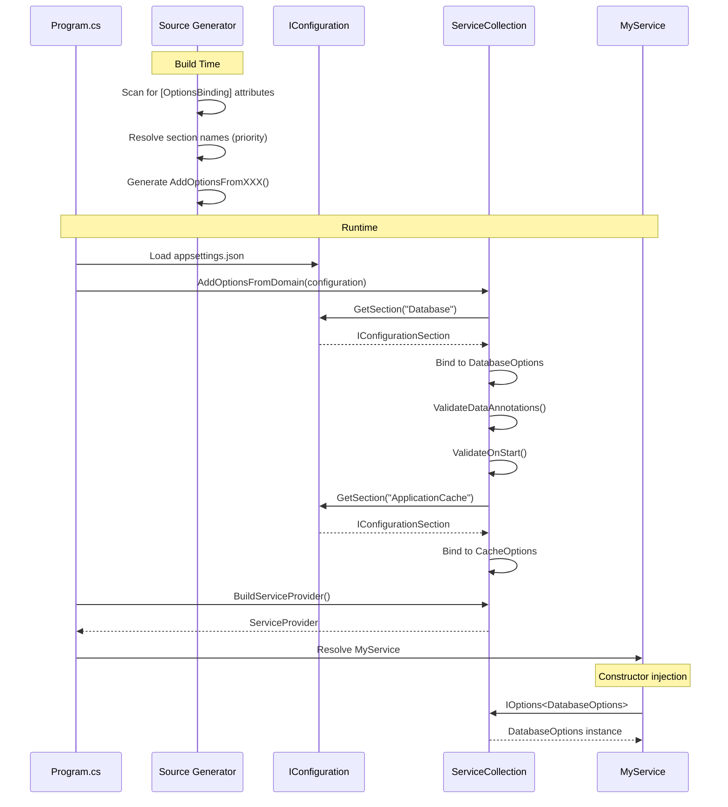

# Options Binding Sample

## 🎯 Focus

This sample demonstrates the **OptionsBindingGenerator** in a multi-project console application with configuration management. The focus is on:

- **Zero boilerplate configuration binding** across multiple projects
- **Automatic section name inference** from class names
- **Type-safe configuration** with validation
- **Multiple configuration sources** (appsettings.json, environment variables)
- **Options lifetime management** (IOptions, IOptionsSnapshot, IOptionsMonitor)
- **Validation at startup** with Data Annotations
- **Custom validation** using IValidateOptions<T> for complex business rules
- **Configuration change callbacks** - Automatic OnChange notifications with Monitor lifetime

## 📁 Sample Projects

- **Atc.SourceGenerators.OptionsBinding** - Console application (entry point)
- **Atc.SourceGenerators.OptionsBinding.Domain** - Domain layer with options classes

## 🏗️ Architecture



## 🔄 Binding Flow



## 💻 Code Example

### Configuration File (appsettings.json)

```json
{
  "Database": {
    "ConnectionString": "Server=localhost;Database=MyApp;",
    "MaxRetries": 3,
    "CommandTimeout": 30
  },
  "ApplicationCache": {
    "MaxSize": 1000,
    "ExpirationMinutes": 60,
    "SlidingExpiration": true
  },
  "App": {
    "Api": {
      "BaseUrl": "https://api.example.com",
      "Timeout": 30,
      "MaxRetries": 3
    }
  },
  "Logging": {
    "Level": "Information",
    "IncludeScopes": true
  }
}
```

### Domain Layer Options

```csharp
using Atc.SourceGenerators.Annotations;
using System.ComponentModel.DataAnnotations;

namespace Atc.SourceGenerators.OptionsBinding.Domain;

// Explicit section name (highest priority)
// Demonstrates fail-fast validation when configuration section is missing
[OptionsBinding("Database", ValidateDataAnnotations = true, ValidateOnStart = true, ErrorOnMissingKeys = true)]
public partial class DatabaseOptions
{
    [Required]
    [MinLength(10)]
    public string ConnectionString { get; set; } = string.Empty;

    [Range(1, 10)]
    public int MaxRetries { get; set; } = 3;

    [Range(1, 300)]
    public int CommandTimeout { get; set; } = 30;
}

// Using const SectionName (2nd priority)
[OptionsBinding(ValidateDataAnnotations = true)]
public partial class CacheOptions
{
    public const string SectionName = "ApplicationCache";

    [Range(100, 10000)]
    public int MaxSize { get; set; } = 1000;

    [Range(1, 1440)]
    public int ExpirationMinutes { get; set; } = 60;

    public bool SlidingExpiration { get; set; }
}

// Nested section path
[OptionsBinding("App:Api")]
public partial class ApiOptions
{
    [Required]
    [Url]
    public string BaseUrl { get; set; } = string.Empty;

    [Range(1, 300)]
    public int Timeout { get; set; } = 30;

    public int MaxRetries { get; set; } = 3;
}

// Auto-inferred section name from class name (lowest priority)
// Binds to "Logging" section
// Demonstrates configuration change callbacks with Monitor lifetime
[OptionsBinding("Logging", Lifetime = OptionsLifetime.Monitor, OnChange = nameof(OnLoggingChanged))]
public partial class LoggingOptions
{
    public string Level { get; set; } = "Information";
    public bool EnableConsole { get; set; } = true;
    public bool EnableFile { get; set; }
    public string? FilePath { get; set; }

    /// <summary>
    /// Called automatically when the Logging configuration section changes.
    /// Requires appsettings.json to have reloadOnChange: true.
    /// </summary>
    internal static void OnLoggingChanged(
        LoggingOptions options,
        string? name)
    {
        Console.WriteLine($"[OnChange Callback] Logging configuration changed:");
        Console.WriteLine($"  Level: {options.Level}");
        Console.WriteLine($"  EnableConsole: {options.EnableConsole}");
        Console.WriteLine($"  EnableFile: {options.EnableFile}");
        Console.WriteLine($"  FilePath: {options.FilePath ?? \"(not set)\"}");
        Console.WriteLine();
    }
}
```

### Application Setup

**Option 1 - Manual Registration:**

```csharp
using Atc.DependencyInjection;
using Atc.SourceGenerators.Annotations;
using Microsoft.Extensions.Configuration;
using Microsoft.Extensions.DependencyInjection;
using Microsoft.Extensions.Options;

// Build configuration
var configuration = new ConfigurationBuilder()
    .SetBasePath(Directory.GetCurrentDirectory())
    .AddJsonFile("appsettings.json", optional: false)
    .AddEnvironmentVariables()
    .Build();

var services = new ServiceCollection();

// One line per project - that's it!
services.AddOptionsFromAtcSourceGeneratorsOptionsBinding(configuration);
services.AddOptionsFromAtcSourceGeneratorsOptionsBindingDomain(configuration);

// Register your services
services.AddSingleton<MyDatabaseService>();
services.AddScoped<MyCacheService>();

var provider = services.BuildServiceProvider();

// Options are validated at startup due to ValidateOnStart = true
// If validation fails, this will throw
```

**Option 2 - Transitive Registration (Recommended):**

```csharp
using Atc.DependencyInjection;
using Atc.SourceGenerators.Annotations;
using Microsoft.Extensions.Configuration;
using Microsoft.Extensions.DependencyInjection;
using Microsoft.Extensions.Options;

// Build configuration
var configuration = new ConfigurationBuilder()
    .SetBasePath(Directory.GetCurrentDirectory())
    .AddJsonFile("appsettings.json", optional: false)
    .AddEnvironmentVariables()
    .Build();

var services = new ServiceCollection();

// Single call automatically registers options from both projects!
services.AddOptionsFromAtcSourceGeneratorsOptionsBinding(configuration, includeReferencedAssemblies: true);

// Register your services
services.AddSingleton<MyDatabaseService>();
services.AddScoped<MyCacheService>();

var provider = services.BuildServiceProvider();

// Options are validated at startup due to ValidateOnStart = true
// If validation fails, this will throw
```

**All Available Overloads:**

```csharp
// Overload 1: Default (no transitive registration)
services.AddOptionsFromYourProject(configuration);

// Overload 2: Auto-detect ALL referenced assemblies recursively
services.AddOptionsFromYourProject(configuration, includeReferencedAssemblies: true);

// Overload 3: Register specific referenced assembly (short or full name)
services.AddOptionsFromYourProject(configuration, "Domain");
services.AddOptionsFromYourProject(configuration, "MyApp.Domain");

// Overload 4: Register multiple specific assemblies
services.AddOptionsFromYourProject(configuration, "Domain", "DataAccess", "Infrastructure");
```

### Service Consumption

```csharp
using Microsoft.Extensions.Options;

// Singleton service with IOptions<T> (best for singleton lifetime)
public class MyDatabaseService
{
    private readonly DatabaseOptions _options;

    public MyDatabaseService(IOptions<DatabaseOptions> options)
    {
        _options = options.Value;
        Console.WriteLine($"DB: {_options.ConnectionString}");
    }
}

// Scoped service with IOptionsSnapshot<T> (reloads per request)
public class MyCacheService
{
    private readonly CacheOptions _options;

    public MyCacheService(IOptionsSnapshot<CacheOptions> options)
    {
        _options = options.Value;
        Console.WriteLine($"Cache max size: {_options.MaxSize}");
    }
}

// Service with IOptionsMonitor<T> (live reload support)
public class MyLoggingService
{
    private readonly IOptionsMonitor<LoggingOptions> _monitor;

    public MyLoggingService(IOptionsMonitor<LoggingOptions> monitor)
    {
        _monitor = monitor;

        // React to configuration changes
        _monitor.OnChange(options =>
        {
            Console.WriteLine($"Logging level changed to: {options.Level}");
        });
    }

    public void Log(string message)
    {
        var currentOptions = _monitor.CurrentValue;
        Console.WriteLine($"[{currentOptions.Level}] {message}");
    }
}
```

## 📝 Generated Code

The generator creates this extension method in each project:

```csharp
// <auto-generated />
namespace Atc.SourceGenerators.Annotations;

public static class ServiceCollectionExtensions
{
    public static IServiceCollection AddOptionsFromAtcSourceGeneratorsOptionsBindingDomain(
        this IServiceCollection services,
        IConfiguration configuration)
    {
        // DatabaseOptions - explicit section name
        services.AddOptions<DatabaseOptions>()
            .Bind(configuration.GetSection("Database"))
            .ValidateDataAnnotations()
            .ValidateOnStart();

        // CacheOptions - const SectionName
        services.AddOptions<CacheOptions>()
            .Bind(configuration.GetSection("ApplicationCache"))
            .ValidateDataAnnotations();

        // ApiOptions - nested section path
        services.AddOptions<ApiOptions>()
            .Bind(configuration.GetSection("App:Api"));

        // LoggingOptions - auto-inferred name + Monitor lifetime
        services.Configure<LoggingOptions>(
            configuration.GetSection("Logging"));
        services.AddSingleton<IOptionsChangeTokenSource<LoggingOptions>>(
            new ConfigurationChangeTokenSource<LoggingOptions>(
                configuration.GetSection("Logging")));

        return services;
    }
}
```

## ✨ Section Name Resolution Priority

The generator resolves section names in this order:

1. **Explicit constructor parameter**: `[OptionsBinding("Database")]` → `"Database"`
2. **`const string SectionName`**: Binds to the value of this constant
3. **`const string NameTitle`**: Fallback if SectionName doesn't exist
4. **`const string Name`**: Fallback if NameTitle doesn't exist
5. **Auto-inferred from class name**: `LoggingOptions` → `"Logging"` (removes "Options" suffix)

### Example

```csharp
[OptionsBinding]  // Explicit parameter wins if provided
public partial class MyOptions
{
    public const string SectionName = "Section1";  // 2nd priority - USED
    public const string NameTitle = "Section2";    // 3rd priority
    public const string Name = "Section3";         // 4th priority
    // Auto-inferred would be "My" (5th priority)
}
// Binds to "Section1"
```

## 🎯 Options Lifetime Comparison

| Lifetime | Interface | Use Case | Reload Behavior |
|----------|-----------|----------|----------------|
| **Singleton** | `IOptions<T>` | Static configuration that never changes | No reload |
| **Scoped** | `IOptionsSnapshot<T>` | Per-request configuration (web apps) | Reloads per scope |
| **Monitor** | `IOptionsMonitor<T>` | Real-time configuration changes | Live reload with notifications |

### When to Use Each

```csharp
// Singleton - For services that don't need config updates
[OptionsBinding(Lifetime = OptionsLifetime.Singleton)]
public partial class DatabaseOptions { }
// Inject: IOptions<DatabaseOptions>

// Scoped - For web apps that need fresh config per request
[OptionsBinding(Lifetime = OptionsLifetime.Scoped)]
public partial class FeatureFlags { }
// Inject: IOptionsSnapshot<FeatureFlags>

// Monitor - For services that need real-time updates
[OptionsBinding(Lifetime = OptionsLifetime.Monitor)]
public partial class LoggingOptions { }
// Inject: IOptionsMonitor<LoggingOptions>
```

## 🔔 Configuration Change Callbacks

The **OptionsBindingGenerator** can automatically generate IHostedService classes to register callbacks that fire when configuration changes are detected. This is perfect for reacting to runtime configuration updates without restarting your application.

### Requirements

1. **Monitor Lifetime**: `Lifetime = OptionsLifetime.Monitor` (required)
2. **OnChange Parameter**: Specify the callback method name via `OnChange = nameof(YourCallback)`
3. **Callback Signature**: Static method with signature `void MethodName(TOptions options, string? name)`
4. **Configuration Reload**: Ensure `appsettings.json` is loaded with `reloadOnChange: true`

### Example 1: Logging Configuration Changes

**LoggingOptions.cs** (from `Atc.SourceGenerators.OptionsBinding` sample):

```csharp
using Atc.SourceGenerators.Annotations;

namespace Atc.SourceGenerators.OptionsBinding.Options;

/// <summary>
/// Logging configuration options.
/// Explicitly binds to "Logging" section in appsettings.json.
/// Demonstrates configuration change callbacks with Monitor lifetime.
/// </summary>
[OptionsBinding("Logging", Lifetime = OptionsLifetime.Monitor, OnChange = nameof(OnLoggingChanged))]
public partial class LoggingOptions
{
    public string Level { get; set; } = "Information";

    public bool EnableConsole { get; set; } = true;

    public bool EnableFile { get; set; }

    public string? FilePath { get; set; }

    /// <summary>
    /// Called automatically when the Logging configuration section changes.
    /// Requires appsettings.json to have reloadOnChange: true.
    /// </summary>
    internal static void OnLoggingChanged(
        LoggingOptions options,
        string? name)
    {
        Console.WriteLine($"[OnChange Callback] Logging configuration changed:");
        Console.WriteLine($"  Level: {options.Level}");
        Console.WriteLine($"  EnableConsole: {options.EnableConsole}");
        Console.WriteLine($"  EnableFile: {options.EnableFile}");
        Console.WriteLine($"  FilePath: {options.FilePath ?? \"(not set)\"}");
        Console.WriteLine();
    }
}
```

### Example 2: Feature Flag Changes

**FeaturesOptions.cs** (from `PetStore.Domain` sample):

```csharp
using Atc.SourceGenerators.Annotations;

namespace PetStore.Domain.Options;

/// <summary>
/// Feature toggle configuration options.
/// Demonstrates configuration change callbacks with Monitor lifetime.
/// Changes to feature flags in appsettings.json are detected automatically.
/// </summary>
[OptionsBinding("Features", Lifetime = OptionsLifetime.Monitor, OnChange = nameof(OnFeaturesChanged))]
public partial class FeaturesOptions
{
    /// <summary>
    /// Gets or sets a value indicating whether the new UI is enabled.
    /// </summary>
    public bool EnableNewUI { get; set; }

    /// <summary>
    /// Gets or sets a value indicating whether advanced search is enabled.
    /// </summary>
    public bool EnableAdvancedSearch { get; set; } = true;

    /// <summary>
    /// Gets or sets a value indicating whether pet recommendations are enabled.
    /// </summary>
    public bool EnableRecommendations { get; set; } = true;

    /// <summary>
    /// Gets or sets a value indicating whether beta features are enabled.
    /// </summary>
    public bool EnableBetaFeatures { get; set; }

    /// <summary>
    /// Called automatically when the Features configuration section changes.
    /// Requires appsettings.json to have reloadOnChange: true.
    /// </summary>
    internal static void OnFeaturesChanged(
        FeaturesOptions options,
        string? name)
    {
        Console.WriteLine("[OnChange Callback] Feature flags changed:");
        Console.WriteLine($"  EnableNewUI: {options.EnableNewUI}");
        Console.WriteLine($"  EnableAdvancedSearch: {options.EnableAdvancedSearch}");
        Console.WriteLine($"  EnableRecommendations: {options.EnableRecommendations}");
        Console.WriteLine($"  EnableBetaFeatures: {options.EnableBetaFeatures}");
        Console.WriteLine();
    }
}
```

### Generated Code

The generator automatically creates an internal `IHostedService` class to register the callback:

```csharp
// <auto-generated />
namespace PetStore.Domain.Options;

[global::System.CodeDom.Compiler.GeneratedCode("Atc.SourceGenerators.OptionsBindingGenerator", "1.0.0")]
[global::System.ComponentModel.EditorBrowsable(global::System.ComponentModel.EditorBrowsableState.Never)]
[global::System.Runtime.CompilerServices.CompilerGenerated]
[global::System.Diagnostics.DebuggerNonUserCode]
[global::System.Diagnostics.CodeAnalysis.ExcludeFromCodeCoverage]
internal sealed class FeaturesOptionsMonitorService : Microsoft.Extensions.Hosting.IHostedService, global::System.IDisposable
{
    private readonly Microsoft.Extensions.Options.IOptionsMonitor<FeaturesOptions> _monitor;
    private global::System.IDisposable? _changeToken;

    public FeaturesOptionsMonitorService(Microsoft.Extensions.Options.IOptionsMonitor<FeaturesOptions> monitor)
    {
        _monitor = monitor;
    }

    public global::System.Threading.Tasks.Task StartAsync(global::System.Threading.CancellationToken cancellationToken)
    {
        _changeToken = _monitor.OnChange(FeaturesOptions.OnFeaturesChanged);
        return global::System.Threading.Tasks.Task.CompletedTask;
    }

    public global::System.Threading.Tasks.Task StopAsync(global::System.Threading.CancellationToken cancellationToken)
    {
        return global::System.Threading.Tasks.Task.CompletedTask;
    }

    public void Dispose()
    {
        _changeToken?.Dispose();
    }
}
```

The registration extension method also includes:

```csharp
// Register the IHostedService
services.AddHostedService<FeaturesOptionsMonitorService>();

// Register IOptionsMonitor
services.AddSingleton<IOptionsChangeTokenSource<FeaturesOptions>>(
    new ConfigurationChangeTokenSource<FeaturesOptions>(
        configuration.GetSection("Features")));
services.Configure<FeaturesOptions>(configuration.GetSection("Features"));
```

### Configuration Setup

To enable configuration reload, ensure your `ConfigurationBuilder` uses `reloadOnChange: true`:

```csharp
var configuration = new ConfigurationBuilder()
    .SetBasePath(Directory.GetCurrentDirectory())
    .AddJsonFile("appsettings.json", optional: false, reloadOnChange: true)  // ← Enable reload
    .Build();
```

**appsettings.json:**

```json
{
  "Features": {
    "EnableNewUI": false,
    "EnableAdvancedSearch": true,
    "EnableRecommendations": true,
    "EnableBetaFeatures": false
  },
  "Logging": {
    "Level": "Information",
    "EnableConsole": true,
    "EnableFile": false,
    "FilePath": null
  }
}
```

### How It Works

1. **Build Time**: Generator detects `OnChange` parameter and validates callback signature
2. **Application Startup**: IHostedService is registered and started
3. **Runtime**: When `appsettings.json` changes on disk, the file watcher triggers a reload
4. **Callback Execution**: Your callback method is automatically invoked with the new values

### Use Cases

- **Feature Flags**: Toggle features on/off without restarting
- **Logging Levels**: Adjust log verbosity in production
- **Rate Limits**: Update throttling thresholds dynamically
- **API Endpoints**: Switch between failover endpoints
- **Cache Sizes**: Adjust memory limits based on load

### Validation Diagnostics

The generator enforces these rules at compile time:

| Diagnostic | Severity | Description |
|------------|----------|-------------|
| **ATCOPT004** | Error | OnChange requires `Lifetime = OptionsLifetime.Monitor` |
| **ATCOPT005** | Error | OnChange is not supported with named options |
| **ATCOPT006** | Error | Callback method not found in options class |
| **ATCOPT007** | Error | Callback must be static void with signature `(TOptions, string?)` |

### Important Notes

- **Thread Safety**: Callbacks may fire on background threads - ensure thread-safe access to shared state
- **Performance**: Keep callbacks lightweight - they block configuration updates
- **Disposal**: The generated IHostedService properly disposes change tokens on shutdown
- **Named Options**: OnChange callbacks are NOT supported with named options (use `IOptionsMonitor<T>.OnChange()` manually instead)

## 📛 Named Options Support

**Named Options** allow multiple configurations of the same options type with different names - perfect for fallback scenarios, multi-tenant applications, or multi-region deployments.

### 🎯 Example: Email Server Fallback

**Options Class:**

```csharp
using Atc.SourceGenerators.Annotations;

namespace Atc.SourceGenerators.OptionsBinding.Options;

[OptionsBinding("Email:Primary", Name = "Primary")]
[OptionsBinding("Email:Secondary", Name = "Secondary")]
[OptionsBinding("Email:Fallback", Name = "Fallback")]
public partial class EmailOptions
{
    public string SmtpServer { get; set; } = string.Empty;
    public int Port { get; set; } = 587;
    public bool UseSsl { get; set; } = true;
    public string FromAddress { get; set; } = string.Empty;
    public int TimeoutSeconds { get; set; } = 30;
}
```

**Configuration (appsettings.json):**

```json
{
  "Email": {
    "Primary": {
      "SmtpServer": "smtp.primary.example.com",
      "Port": 587,
      "UseSsl": true,
      "FromAddress": "noreply@primary.example.com",
      "TimeoutSeconds": 30
    },
    "Secondary": {
      "SmtpServer": "smtp.secondary.example.com",
      "Port": 587,
      "UseSsl": true,
      "FromAddress": "noreply@secondary.example.com",
      "TimeoutSeconds": 45
    },
    "Fallback": {
      "SmtpServer": "smtp.fallback.example.com",
      "Port": 25,
      "UseSsl": false,
      "FromAddress": "noreply@fallback.example.com",
      "TimeoutSeconds": 60
    }
  }
}
```

**Generated Code:**

```csharp
// <auto-generated />
namespace Atc.SourceGenerators.Annotations;

public static class ServiceCollectionExtensions
{
    public static IServiceCollection AddOptionsFromOptionsBinding(
        this IServiceCollection services,
        IConfiguration configuration)
    {
        // Configure EmailOptions (Named: "Primary")
        services.Configure<EmailOptions>("Primary", configuration.GetSection("Email:Primary"));

        // Configure EmailOptions (Named: "Secondary")
        services.Configure<EmailOptions>("Secondary", configuration.GetSection("Email:Secondary"));

        // Configure EmailOptions (Named: "Fallback")
        services.Configure<EmailOptions>("Fallback", configuration.GetSection("Email:Fallback"));

        return services;
    }
}
```

**Usage in Services:**

```csharp
public class EmailService
{
    private readonly IOptionsSnapshot<EmailOptions> _emailSnapshot;

    public EmailService(IOptionsSnapshot<EmailOptions> emailSnapshot)
    {
        _emailSnapshot = emailSnapshot;
    }

    public async Task SendAsync(string to, string body)
    {
        // Try primary first
        var primaryEmail = _emailSnapshot.Get("Primary");
        if (await TrySendAsync(primaryEmail, to, body))
            return;

        // Fallback to secondary
        var secondaryEmail = _emailSnapshot.Get("Secondary");
        if (await TrySendAsync(secondaryEmail, to, body))
            return;

        // Last resort: fallback server
        var fallbackEmail = _emailSnapshot.Get("Fallback");
        await TrySendAsync(fallbackEmail, to, body);
    }

    private async Task<bool> TrySendAsync(EmailOptions options, string to, string body)
    {
        try
        {
            // Send email using options.SmtpServer, options.Port, etc.
            return true;
        }
        catch
        {
            return false;
        }
    }
}
```

### ⚠️ Important Notes

- **Use `IOptionsSnapshot<T>`**: Named options are accessed via `IOptionsSnapshot<T>.Get(name)`, not `IOptions<T>.Value`
- **No Validation Chain**: Named options use the simpler `Configure<T>(name, section)` pattern without validation support
- **AllowMultiple**: The `[OptionsBinding]` attribute supports multiple instances on the same class

### 🎯 Common Use Cases

- **Fallback Servers**: Primary/Secondary/Fallback email or database servers
- **Multi-Region**: Different API endpoints for US, EU, Asia regions
- **Multi-Tenant**: Tenant-specific configurations
- **Environment Tiers**: Production, Staging, Development endpoints

## ✨ Key Takeaways

1. **Zero Boilerplate**: No manual `AddOptions().Bind()` code to write
2. **Auto-Inference**: Section names can be inferred from class names
3. **Validation**: Built-in support for Data Annotations validation
4. **Type Safety**: Compile-time errors if configuration doesn't match
5. **Multi-Project**: Each project gets its own `AddOptionsFromXXX()` method
6. **Flexible Lifetimes**: Choose between Singleton, Scoped, or Monitor
7. **Startup Validation**: Catch configuration errors before runtime
8. **Error on Missing Keys**: Fail-fast validation when configuration sections are missing
9. **Named Options**: Multiple configurations of the same type for fallback/multi-tenant scenarios
10. **Configuration Change Callbacks**: Auto-generated IHostedService for OnChange notifications with Monitor lifetime

## 🔗 Related Documentation

- [OptionsBinding Generator Guide](OptionsBindingGenerators.md) - Full generator documentation
- [DependencyRegistration Sample](DependencyRegistrationGenerators-Samples.md) - DI registration example
- [Mapping Sample](ObjectMappingGenerators-Samples.md) - Object mapping example
- [PetStore API Sample](PetStoreApi-Samples.md) - Complete application using all generators
