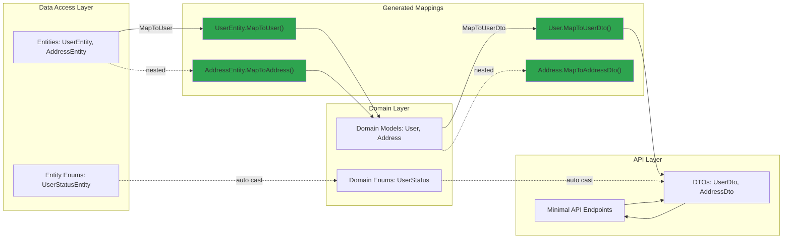
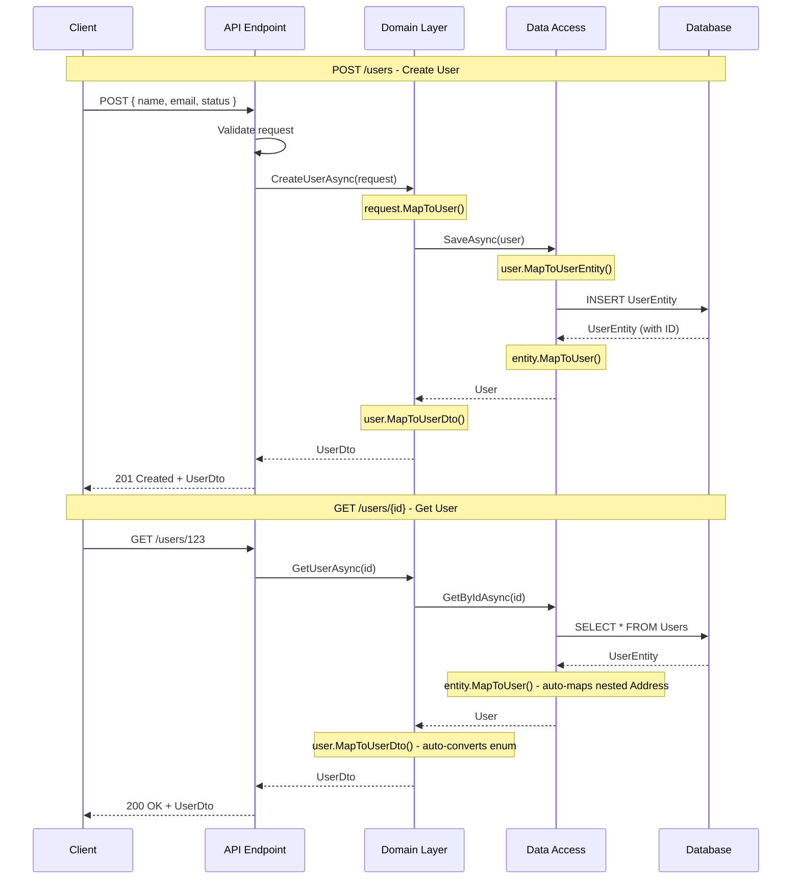

# Object Mapping Sample

## 🎯 Focus

This sample demonstrates the **MappingGenerator** in a realistic 3-layer architecture with ASP.NET Core Minimal API. The focus is on:

- **Type-safe object mapping** across application layers
- **Multi-layer mapping chains** (Entity → Domain → DTO)
- **Automatic enum conversion** between compatible enum types
- **Nested object mapping** with automatic chaining
- **Null safety** for nullable reference types
- **Convention-based mapping** without configuration

## 📁 Sample Projects

- **Atc.SourceGenerators.Mapping** - ASP.NET Core Minimal API (entry point)
- **Atc.SourceGenerators.Mapping.Domain** - Domain models and business logic
- **Atc.SourceGenerators.Mapping.DataAccess** - Data access layer with entities

## 🏗️ Architecture



## 🔄 Mapping Flow



## 💻 Code Example

### Data Access Layer

```csharp
using Atc.SourceGenerators.Annotations;

namespace Atc.SourceGenerators.Mapping.DataAccess;

// Entity with mapping to Domain
[MapTo(typeof(Domain.User))]
public partial class UserEntity
{
    public int DatabaseId { get; set; }
    public Guid Id { get; set; }
    public string Name { get; set; } = string.Empty;
    public string Email { get; set; } = string.Empty;
    public UserStatusEntity Status { get; set; }
    public AddressEntity? Address { get; set; }
    public DateTimeOffset CreatedAt { get; set; }
    public bool IsDeleted { get; set; }  // DB-specific field
}

[MapTo(typeof(Domain.Address))]
public partial class AddressEntity
{
    public string Street { get; set; } = string.Empty;
    public string City { get; set; } = string.Empty;
    public string PostalCode { get; set; } = string.Empty;
}

public enum UserStatusEntity
{
    Active = 0,
    Inactive = 1,
    Suspended = 2
}
```

### Domain Layer

```csharp
using Atc.SourceGenerators.Annotations;

namespace Atc.SourceGenerators.Mapping.Domain;

// Domain model with mapping to DTO
[MapTo(typeof(UserDto))]
public partial class User
{
    public Guid Id { get; init; }
    public string Name { get; init; } = string.Empty;
    public string Email { get; init; } = string.Empty;
    public UserStatus Status { get; init; }
    public Address? Address { get; init; }
    public DateTimeOffset CreatedAt { get; init; }
}

[MapTo(typeof(AddressDto))]
public partial class Address
{
    public string Street { get; init; } = string.Empty;
    public string City { get; init; } = string.Empty;
    public string PostalCode { get; init; } = string.Empty;
}

public enum UserStatus
{
    Active = 0,
    Inactive = 1,
    Suspended = 2
}

// DTOs
public class UserDto
{
    public Guid Id { get; set; }
    public string Name { get; set; } = string.Empty;
    public string Email { get; set; } = string.Empty;
    public string Status { get; set; } = string.Empty;  // Different type!
    public AddressDto? Address { get; set; }
    public DateTimeOffset CreatedAt { get; set; }
}

public class AddressDto
{
    public string Street { get; set; } = string.Empty;
    public string City { get; set; } = string.Empty;
    public string PostalCode { get; set; } = string.Empty;
}
```

### API Usage

```csharp
using Atc.Mapping;
using Atc.SourceGenerators.Mapping.Domain;
using Microsoft.AspNetCore.Mvc;

var app = WebApplication.Create();

// POST endpoint - Create user
app.MapPost("/users", async ([FromBody] CreateUserRequest request) =>
{
    // Convert DTO → Domain
    var user = new User
    {
        Id = Guid.NewGuid(),
        Name = request.Name,
        Email = request.Email,
        Status = UserStatus.Active,
        CreatedAt = DateTimeOffset.UtcNow
    };

    // Convert Domain → Entity
    var entity = user.MapToUserEntity();
    // Save to database...

    // Convert Domain → DTO for response
    var dto = user.MapToUserDto();
    return Results.Created($"/users/{user.Id}", dto);
});

// GET endpoint - Retrieve user
app.MapGet("/users/{id:guid}", async (Guid id) =>
{
    // Fetch from database
    var entity = await repository.GetByIdAsync(id);
    if (entity == null) return Results.NotFound();

    // Complete mapping chain: Entity → Domain → DTO
    var user = entity.MapToUser();      // Auto-converts enum, nested Address
    var dto = user.MapToUserDto();      // Auto-maps all properties

    return Results.Ok(dto);
});

app.Run();
```

## 📝 Generated Code

The generator creates extension methods for each mapping:

```csharp
// <auto-generated />
namespace Atc.Mapping;

public static partial class UserEntityExtensions
{
    public static Domain.User MapToUser(this UserEntity source)
    {
        if (source is null)
        {
            return default!;
        }

        return new Domain.User
        {
            Id = source.Id,
            Name = source.Name,
            Email = source.Email,
            Status = (Domain.UserStatus)source.Status,  // ✨ Auto enum conversion
            Address = source.Address?.MapToAddress()!,  // ✨ Auto nested mapping
            CreatedAt = source.CreatedAt
        };
    }
}

public static partial class UserExtensions
{
    public static UserDto MapToUserDto(this User source)
    {
        if (source is null)
        {
            return default!;
        }

        return new UserDto
        {
            Id = source.Id,
            Name = source.Name,
            Email = source.Email,
            Status = source.Status.ToString(),          // ✨ Enum to string
            Address = source.Address?.MapToAddressDto()!, // ✨ Nested mapping
            CreatedAt = source.CreatedAt
        };
    }
}
```

## ✨ Key Features Demonstrated

### 1. **Multi-Layer Mapping Chains**
```csharp
var dto = entity
    .MapToUser()      // Entity → Domain
    .MapToUserDto();  // Domain → DTO
```

### 2. **Automatic Enum Conversion**
```csharp
// Simple cast (fallback when enums don't have [MapTo] attributes)
Status = (Domain.UserStatus)source.Status

// For safer enum mapping with special case handling (None → Unknown, etc.),
// add [MapTo] attributes to your enums - see EnumMapping sample
```

### 3. **Nested Object Mapping**
```csharp
// Automatically detects AddressEntity has MapToAddress() method
Address = source.Address?.MapToAddress()!
```

### 4. **Null Safety**
```csharp
// Built-in null checks
if (source is null) return default!;

// Null-conditional operator for nullable properties
Address = source.Address?.MapToAddressDto()!
```

### 5. **Convention-Based**
- Properties are matched by name
- No manual configuration needed
- Unmapped properties are simply skipped

## 🎯 Benefits

1. **Zero Boilerplate**: No manual mapping code to write or maintain
2. **Type Safety**: Compile-time errors if properties don't match
3. **Refactoring Safe**: Rename a property, mappings update automatically
4. **Performance**: Zero runtime overhead - all code generated at compile time
5. **Maintainable**: Changes to models automatically propagate through mappings
6. **Testable**: Generated methods are standard C# extension methods

## 🔗 Related Documentation

- [ObjectMapping Generator Guide](../generators/ObjectMapping.md) - Full generator documentation
- [DependencyRegistration Sample](DependencyRegistration.md) - DI registration example
- [OptionsBinding Sample](OptionsBinding.md) - Configuration binding example
- [PetStore API Sample](PetStoreApi.md) - Complete application using all generators
