# Object Mapping Sample

## 🎯 Focus

This sample demonstrates the **MappingGenerator** in a realistic 3-layer architecture with ASP.NET Core Minimal API. The focus is on:

- **Type-safe object mapping** across application layers
- **Multi-layer mapping chains** (Entity → Domain → DTO)
- **Automatic enum conversion** between compatible enum types
- **Nested object mapping** with automatic chaining
- **Null safety** for nullable reference types
- **Convention-based mapping** without configuration

## 📁 Sample Projects

- **Atc.SourceGenerators.Mapping** - ASP.NET Core Minimal API (entry point)
- **Atc.SourceGenerators.Mapping.Domain** - Domain models and business logic
- **Atc.SourceGenerators.Mapping.DataAccess** - Data access layer with entities
- **Atc.SourceGenerators.Mapping.Contract** - API contracts (DTOs)

## 🏗️ Architecture

```mermaid
graph TB
    subgraph "API Layer"
        API[Minimal API Endpoints]
    end

    subgraph "Contract Layer"
        DTO[DTOs: UserDto, AddressDto, UserStatusDto]
    end

    subgraph "Domain Layer"
        DM[Domain Models: User, Address]
        DE[Domain Enums: UserStatus]
    end

    subgraph "Data Access Layer"
        ENT[Entities: UserEntity, AddressEntity]
        EE[Entity Enums: UserStatusEntity]
    end

    subgraph "Generated Bidirectional Mappings"
        M1["User ↔ UserEntity"]
        M2["User → UserDto"]
        M3["Address ↔ AddressEntity"]
        M4["Address → AddressDto"]
        M5["UserStatus ↔ UserStatusEntity"]
        M6["UserStatus → UserStatusDto"]
    end

    API --> DTO
    DTO --> DM
    DM --> M1
    DM --> M2
    DM --> M3
    DM --> M4
    DE --> M5
    DE --> M6
    M1 --> ENT
    M3 --> ENT
    M5 --> EE
    M2 --> DTO
    M4 --> DTO
    M6 --> DTO

    style M1 fill:#2ea44f
    style M2 fill:#2ea44f
    style M3 fill:#2ea44f
    style M4 fill:#2ea44f
    style M5 fill:#2ea44f
    style M6 fill:#2ea44f
```



## 🔄 Mapping Flow


## 💻 Code Example

### Data Access Layer

```csharp
namespace Atc.SourceGenerators.Mapping.DataAccess.Entities;

// Entity - NO mapping attribute (mapping defined in Domain)
public class UserEntity
{
    public int DatabaseId { get; set; }
    public Guid Id { get; set; }
    public string FirstName { get; set; } = string.Empty;
    public string LastName { get; set; } = string.Empty;
    public string Email { get; set; } = string.Empty;
    public UserStatusEntity Status { get; set; }
    public AddressEntity? Address { get; set; }
    public DateTimeOffset CreatedAt { get; set; }
    public DateTimeOffset? UpdatedAt { get; set; }
    public bool IsDeleted { get; set; }  // DB-specific field
    public byte[] RowVersion { get; set; } = [];  // DB-specific field
}

public class AddressEntity
{
    public int Id { get; set; }
    public string Street { get; set; } = string.Empty;
    public string City { get; set; } = string.Empty;
    public string State { get; set; } = string.Empty;
    public string PostalCode { get; set; } = string.Empty;
    public string Country { get; set; } = string.Empty;
    public DateTime CreatedAt { get; set; }
    public DateTime? UpdatedAt { get; set; }
}

public enum UserStatusEntity
{
    Active = 0,
    Inactive = 1,
    Suspended = 2,
    Deleted = 3
}
```

### Domain Layer

```csharp
using Atc.SourceGenerators.Annotations;

namespace Atc.SourceGenerators.Mapping.Domain;

// Domain model with BIDIRECTIONAL mapping to Entity and forward mapping to DTO
[MapTo(typeof(UserDto))]
[MapTo(typeof(UserEntity), Bidirectional = true)]
public partial class User
{
    public Guid Id { get; set; }
    public string FirstName { get; set; } = string.Empty;
    public string LastName { get; set; } = string.Empty;
    public string Email { get; set; } = string.Empty;
    public UserStatus Status { get; set; }
    public Address? Address { get; set; }
    public DateTimeOffset CreatedAt { get; set; }
    public DateTimeOffset? UpdatedAt { get; set; }
}

[MapTo(typeof(AddressDto))]
[MapTo(typeof(AddressEntity), Bidirectional = true)]
public partial class Address
{
    public string Street { get; set; } = string.Empty;
    public string City { get; set; } = string.Empty;
    public string State { get; set; } = string.Empty;
    public string PostalCode { get; set; } = string.Empty;
    public string Country { get; set; } = string.Empty;
}

[MapTo(typeof(UserStatusDto))]
[MapTo(typeof(UserStatusEntity), Bidirectional = true)]
public enum UserStatus
{
    Active = 0,
    Inactive = 1,
    Suspended = 2,
    Deleted = 3
}
```

### Contract Layer

```csharp
namespace Atc.SourceGenerators.Mapping.Contract;

// DTOs - no mapping attributes needed (mapped from Domain)
public class UserDto
{
    public Guid Id { get; set; }
    public string FirstName { get; set; } = string.Empty;
    public string LastName { get; set; } = string.Empty;
    public string Email { get; set; } = string.Empty;
    public UserStatusDto Status { get; set; }
    public AddressDto? Address { get; set; }
    public DateTimeOffset CreatedAt { get; set; }
    public DateTimeOffset? UpdatedAt { get; set; }
}

public class AddressDto
{
    public string Street { get; set; } = string.Empty;
    public string City { get; set; } = string.Empty;
    public string State { get; set; } = string.Empty;
    public string PostalCode { get; set; } = string.Empty;
    public string Country { get; set; } = string.Empty;
}

public enum UserStatusDto
{
    Active = 0,
    Inactive = 1,
    Suspended = 2,
    Deleted = 3
}
```

### API Usage

```csharp
using Atc.Mapping;
using Atc.SourceGenerators.Mapping.Contract;
using Atc.SourceGenerators.Mapping.Domain;
using Microsoft.AspNetCore.Mvc;

var builder = WebApplication.CreateBuilder(args);

// Register services
builder.Services.AddSingleton<IUserRepository, UserRepository>();
builder.Services.AddSingleton<UserService>();

var app = builder.Build();

// GET endpoint - Retrieve user by ID
app.MapGet("/users/{id:guid}", (Guid id, UserService userService) =>
{
    var user = userService.GetById(id);
    if (user is null)
    {
        return Results.NotFound(new { message = $"User with ID {id} not found" });
    }

    // ✨ Use generated mapping: Domain → DTO
    var data = user.MapToUserDto();
    return Results.Ok(data);
})
.WithName("GetUserById")
.Produces<UserDto>(StatusCodes.Status200OK)
.Produces(StatusCodes.Status404NotFound);

// GET endpoint - Retrieve all users
app.MapGet("/users", (UserService userService) =>
{
    // ✨ Use generated mapping: Domain → DTO
    var data = userService
        .GetAll()
        .Select(u => u.MapToUserDto())
        .ToList();
    return Results.Ok(data);
})
.WithName("GetAllUsers")
.Produces<List<UserDto>>(StatusCodes.Status200OK);

await app.RunAsync();
```

## 📝 Generated Code

The generator creates extension methods for bidirectional mappings:

```csharp
// <auto-generated />
namespace Atc.Mapping;

// Bidirectional mapping: User ↔ UserEntity
public static partial class UserExtensions
{
    public static UserEntity MapToUserEntity(this User source)
    {
        if (source is null)
        {
            return default!;
        }

        return new UserEntity
        {
            Id = source.Id,
            FirstName = source.FirstName,
            LastName = source.LastName,
            Email = source.Email,
            Status = source.Status.MapToUserStatusEntity(),  // ✨ Safe enum mapping (bidirectional)
            Address = source.Address?.MapToAddressEntity()!, // ✨ Auto nested mapping
            CreatedAt = source.CreatedAt,
            UpdatedAt = source.UpdatedAt
        };
    }

    public static UserDto MapToUserDto(this User source)
    {
        if (source is null)
        {
            return default!;
        }

        return new UserDto
        {
            Id = source.Id,
            FirstName = source.FirstName,
            LastName = source.LastName,
            Email = source.Email,
            Status = source.Status.MapToUserStatusDto(),    // ✨ Safe enum mapping
            Address = source.Address?.MapToAddressDto()!,   // ✨ Nested mapping
            CreatedAt = source.CreatedAt,
            UpdatedAt = source.UpdatedAt
        };
    }
}

public static partial class UserEntityExtensions
{
    // Reverse mapping (from Bidirectional = true)
    public static User MapToUser(this UserEntity source)
    {
        if (source is null)
        {
            return default!;
        }

        return new User
        {
            Id = source.Id,
            FirstName = source.FirstName,
            LastName = source.LastName,
            Email = source.Email,
            Status = source.Status.MapToUserStatus(),    // ✨ Safe enum mapping (reverse)
            Address = source.Address?.MapToAddress()!,   // ✨ Auto nested mapping
            CreatedAt = source.CreatedAt,
            UpdatedAt = source.UpdatedAt
        };
    }
}
```

## ✨ Key Features Demonstrated

### 1. **Multi-Layer Mapping Chains**
```csharp
var dto = entity
    .MapToUser()      // Entity → Domain
    .MapToUserDto();  // Domain → DTO
```

### 2. **Automatic Enum Conversion**
```csharp
// Simple cast (fallback when enums don't have [MapTo] attributes)
Status = (Domain.UserStatus)source.Status

// For safer enum mapping with special case handling (None → Unknown, etc.),
// add [MapTo] attributes to your enums - see EnumMapping sample
```

### 3. **Nested Object Mapping**
```csharp
// Automatically detects AddressEntity has MapToAddress() method
Address = source.Address?.MapToAddress()!
```

### 4. **Null Safety**
```csharp
// Built-in null checks
if (source is null) return default!;

// Null-conditional operator for nullable properties
Address = source.Address?.MapToAddressDto()!
```

### 5. **Convention-Based**
- Properties are matched by name
- No manual configuration needed
- Unmapped properties are simply skipped

## 🎯 Benefits

1. **Zero Boilerplate**: No manual mapping code to write or maintain
2. **Type Safety**: Compile-time errors if properties don't match
3. **Refactoring Safe**: Rename a property, mappings update automatically
4. **Performance**: Zero runtime overhead - all code generated at compile time
5. **Maintainable**: Changes to models automatically propagate through mappings
6. **Testable**: Generated methods are standard C# extension methods

## 🔗 Related Documentation

- [ObjectMapping Generator Guide](../generators/ObjectMapping.md) - Full generator documentation
- [DependencyRegistration Sample](DependencyRegistration.md) - DI registration example
- [OptionsBinding Sample](OptionsBinding.md) - Configuration binding example
- [PetStore API Sample](PetStoreApi.md) - Complete application using all generators
