# PetStore API Sample

## 🎯 Focus

This sample demonstrates **all three generators working together** in a realistic ASP.NET Core 10.0 application with OpenAPI/Scalar documentation. The focus is on:

- **Complete 3-layer architecture** (API → Domain → DataAccess)
- **All generators in harmony** (DependencyRegistration + OptionsBinding + Mapping)
- **OpenAPI/Swagger integration** with XML documentation
- **Type-safe configuration** with validation
- **Zero boilerplate** across all layers
- **Production-ready patterns** for modern .NET applications

## 📁 Sample Projects

- **PetStore.Api** - ASP.NET Core Minimal API with OpenAPI/Scalar
- **PetStore.Domain** - Domain layer (services, validation, mappings)
- **PetStore.DataAccess** - Data access layer (repositories, entities)
- **PetStore.Api.Contract** - API contracts (DTOs, requests/responses)

## 🏗️ Architecture


### Project References (Clean Architecture)

```
PetStore.Api
├── PetStore.Domain
│   ├── PetStore.DataAccess (NO Api.Contract reference)
│   └── PetStore.Api.Contract
└── PetStore.Api.Contract

Key: DataAccess has NO upward dependencies, maintaining clean architecture
```

## 🔄 Request Flow: Creating a Pet

```mermaid
sequenceDiagram
    participant Client
    participant API as API Endpoint
    participant PetService as PetService [Registration]
    participant Options as PetStoreOptions [OptionsBinding]
    participant Repository as PetRepository [Registration]
    participant Mapping as Generated Mappings

    Note over Client,Mapping: POST /pets

    Client->>API: HTTP POST /pets
    Note over API: CreatePetRequest DTO

    API->>PetService: CreatePet(request)
    PetService->>Options: Get MaxPetsPerPage
    Options-->>PetService: 100

    Note over PetService: Create Pet with Status = Models.PetStatus.Available
    PetService->>PetService: new Pet { Status = PetStatus.Available }

    Note right of Mapping: Bidirectional Generated Code
    PetService->>Mapping: pet.MapToPetEntity()
    Note right of Mapping: Enum cast: PetStatus → PetStatusEntity
    Mapping-->>PetService: PetEntity

    PetService->>Repository: Create(entity)
    Repository->>Repository: Save to storage
    Note right of Mapping: Bidirectional Generated Code
    Repository->>Mapping: entity.MapToPet()
    Note right of Mapping: Enum cast: PetStatusEntity → PetStatus
    Mapping-->>Repository: Pet
    Repository-->>PetService: Pet

    Note right of Mapping: Generated Code
    PetService->>Mapping: pet.MapToPetResponse()
    Mapping-->>PetService: PetResponse
    PetService-->>API: PetResponse

    API-->>Client: 200 OK + PetResponse
```



## 🔄 Request Flow: Getting a Pet

```mermaid
sequenceDiagram
    participant Client
    participant API as API Endpoint
    participant PetService as PetService [Registration]
    participant Repository as PetRepository [Registration]
    participant Mapping as Generated Mappings

    Note over Client,Mapping: GET /pets/{id}

    Client->>API: HTTP GET /pets/{id}
    API->>PetService: GetById(id)
    PetService->>Repository: GetById(id)

    Note right of Mapping: Bidirectional Generated Code
    Repository->>Repository: Retrieve PetEntity from storage
    Repository->>Mapping: entity.MapToPet()
    Note right of Mapping: Enum cast: PetStatusEntity → PetStatus
    Mapping-->>Repository: Pet
    Repository-->>PetService: Pet

    Note right of Mapping: Generated Code
    PetService->>Mapping: pet.MapToPetResponse()
    Mapping-->>PetService: PetResponse
    PetService-->>API: PetResponse

    API-->>Client: 200 OK + PetResponse
```



## 🔄 Request Flow: Getting Pets by Status

```mermaid
sequenceDiagram
    participant Client
    participant API as API Endpoint
    participant PetService as PetService [Registration]
    participant Repository as PetRepository [Registration]
    participant Mapping as Generated Mappings

    Note over Client,Mapping: GET /pets/status/Available

    Client->>API: HTTP GET /pets/status/Available
    Note over API: PetStatus (Api.Contract enum)
    API->>API: Cast to Domain.Models.PetStatus
    API->>PetService: GetByStatus(status)
    Note over PetService: Cast to PetStatusEntity
    PetService->>Repository: GetByStatus((PetStatusEntity)status)

    Note right of Mapping: Bidirectional Generated Code
    Repository->>Repository: Filter by PetStatusEntity
    loop For each PetEntity
        Repository->>Mapping: entity.MapToPet()
        Note right of Mapping: Enum cast: PetStatusEntity → PetStatus
        Mapping-->>Repository: Pet
    end
    Repository-->>PetService: IEnumerable<Pet>

    Note right of Mapping: Generated Code
    loop For each Pet
        PetService->>Mapping: pet.MapToPetResponse()
        Mapping-->>PetService: PetResponse
    end
    PetService-->>API: IEnumerable<PetResponse>

    API-->>Client: 200 OK + PetResponse[]
```



## 💻 Code Example

### Configuration (appsettings.json)

```json
{
  "PetStore": {
    "MaxPetsPerPage": 100
  },
  "Logging": {
    "LogLevel": {
      "Default": "Information"
    }
  }
}
```

### PetStore.Api.Contract (DTOs)

```csharp
namespace PetStore.Api.Contract;

/// <summary>
/// Request to create a new pet.
/// </summary>
public class CreatePetRequest
{
    public string Name { get; set; } = string.Empty;
    public string Species { get; set; } = string.Empty;
    public string Breed { get; set; } = string.Empty;
    public int Age { get; set; }
}

/// <summary>
/// Pet response DTO.
/// </summary>
public class PetResponse
{
    public Guid Id { get; set; }
    public string Name { get; set; } = string.Empty;
    public string Species { get; set; } = string.Empty;
    public string Breed { get; set; } = string.Empty;
    public int Age { get; set; }
    public PetStatus Status { get; set; }
    public DateTimeOffset CreatedAt { get; set; }
}

/// <summary>
/// Represents the status of a pet (API layer).
/// </summary>
public enum PetStatus
{
    Available = 0,
    Pending = 1,
    Adopted = 2,
}
```

### PetStore.Domain (Services & Models)

```csharp
using Atc.SourceGenerators.Annotations;
using System.ComponentModel.DataAnnotations;

namespace PetStore.Domain;

// ✨ Options bound automatically
[OptionsBinding("PetStore", ValidateDataAnnotations = true, ValidateOnStart = true)]
public partial class PetStoreOptions
{
    [Range(1, 100)]
    public int MaxPetsPerPage { get; set; } = 20;

    [Required]
    [StringLength(100, MinimumLength = 1)]
    public string StoreName { get; set; } = "Furry Friends Pet Store";

    public bool EnableAutoStatusUpdates { get; set; } = true;
}

// ✨ Auto-registered as IPetService (default: Singleton)
[Registration]
public class PetService : IPetService
{
    private readonly IPetRepository repository;
    private readonly PetStoreOptions options;

    public PetService(
        IPetRepository repository,
        IOptions<PetStoreOptions> options)
    {
        ArgumentNullException.ThrowIfNull(options);
        this.repository = repository;
        this.options = options.Value;
    }

    public Pet? GetById(Guid id)
    {
        var entity = repository.GetById(id);
        return entity?.MapToPet();  // ✨ Bidirectional mapping (PetEntity → Pet)
    }

    public IEnumerable<Pet> GetAll() =>
        repository
            .GetAll()
            .Select(e => e.MapToPet())  // ✨ Bidirectional mapping
            .Take(options.MaxPetsPerPage);

    public IEnumerable<Pet> GetByStatus(Models.PetStatus status) =>
        repository
            .GetByStatus((PetStatusEntity)status)  // ✨ Enum cast: Domain → DataAccess
            .Select(e => e.MapToPet());  // ✨ Bidirectional mapping

    public Pet CreatePet(CreatePetRequest request)
    {
        ArgumentNullException.ThrowIfNull(request);

        var pet = new Pet
        {
            Id = Guid.NewGuid(),
            Name = request.Name,
            Species = request.Species,
            Breed = request.Breed,
            Age = request.Age,
            Status = Models.PetStatus.Available,  // ✨ Domain enum
            CreatedAt = DateTimeOffset.UtcNow,
        };

        var entity = pet.MapToPetEntity();  // ✨ Bidirectional mapping (Pet → PetEntity)
        var createdEntity = repository.Create(entity);
        return createdEntity.MapToPet();  // ✨ Bidirectional mapping (PetEntity → Pet)
    }
}

// ✨ Domain model with bidirectional mapping
[MapTo(typeof(PetResponse))]
[MapTo(typeof(PetEntity), Bidirectional = true)]  // ✨ Generates both Pet→PetEntity AND PetEntity→Pet
public partial class Pet
{
    public Guid Id { get; set; }
    public string Name { get; set; } = string.Empty;
    public string Species { get; set; } = string.Empty;
    public string Breed { get; set; } = string.Empty;
    public int Age { get; set; }
    public PetStatus Status { get; set; }  // ✨ Domain enum
    public DateTimeOffset CreatedAt { get; set; }
}

// ✨ Domain-layer enum (separate from API and DataAccess)
public enum PetStatus
{
    Available = 0,
    Pending = 1,
    Adopted = 2,
}
```

### PetStore.DataAccess (Repository & Entities)

```csharp
using Atc.SourceGenerators.Annotations;

namespace PetStore.DataAccess;

// ✨ Auto-registered as IPetRepository (Singleton lifetime)
[Registration(Lifetime.Singleton)]
public class PetRepository : IPetRepository
{
    private readonly Dictionary<Guid, PetEntity> pets;

    public PetRepository()
    {
        // Initialize with sample data
        var pet1Id = Guid.Parse("11111111-1111-1111-1111-111111111111");
        var pet2Id = Guid.Parse("22222222-2222-2222-2222-222222222222");

        pets = new Dictionary<Guid, PetEntity>
        {
            [pet1Id] = new PetEntity
            {
                Id = pet1Id,
                Name = "Buddy",
                Species = "Dog",
                Breed = "Golden Retriever",
                Age = 3,
                Status = Entities.PetStatusEntity.Available,  // ✨ DataAccess enum
                CreatedAt = DateTimeOffset.UtcNow.AddDays(-30),
            },
            [pet2Id] = new PetEntity
            {
                Id = pet2Id,
                Name = "Whiskers",
                Species = "Cat",
                Breed = "Siamese",
                Age = 2,
                Status = Entities.PetStatusEntity.Adopted,  // ✨ DataAccess enum
                CreatedAt = DateTimeOffset.UtcNow.AddDays(-45),
            },
        };
    }

    public PetEntity? GetById(Guid id) =>
        !pets.TryGetValue(id, out var entity) ? null : entity;

    public IEnumerable<PetEntity> GetAll() =>
        pets.Values;

    public IEnumerable<PetEntity> GetByStatus(Entities.PetStatusEntity status) =>
        pets.Values.Where(e => e.Status == status);

    public PetEntity Create(PetEntity pet)
    {
        pets[pet.Id] = pet;
        return pet;
    }
}

// ✨ Entity - no MapTo attribute needed (Pet has Bidirectional = true)
public class PetEntity
{
    public Guid Id { get; set; }
    public string Name { get; set; } = string.Empty;
    public string Species { get; set; } = string.Empty;
    public string Breed { get; set; } = string.Empty;
    public int Age { get; set; }
    public PetStatusEntity Status { get; set; }  // ✨ DataAccess enum
    public DateTimeOffset CreatedAt { get; set; }
}

// ✨ DataAccess-layer enum (separate from API and Domain)
public enum PetStatusEntity
{
    Available = 0,
    Pending = 1,
    Adopted = 2,
}
```

### PetStore.Api (Application Setup)

```csharp
using Microsoft.AspNetCore.Mvc;

var builder = WebApplication.CreateBuilder(args);

// ✨ Scenario B: Register all services transitively (Domain + DataAccess)
// This single call registers:
//   - PetService from PetStore.Domain
//   - PetRepository from PetStore.DataAccess (auto-detected as referenced assembly)
builder.Services.AddDependencyRegistrationsFromPetStoreDomain(
    includeReferencedAssemblies: true);

// ✨ Register configuration options automatically via [OptionsBinding] attribute
// This single call registers options from PetStore.Domain (PetStoreOptions)
builder.Services.AddOptionsFromPetStoreDomain(
    builder.Configuration,
    includeReferencedAssemblies: true);

// Add OpenAPI
builder.Services.AddOpenApi();

var app = builder.Build();

// Configure the HTTP request pipeline
if (app.Environment.IsDevelopment())
{
    app.MapOpenApi();
    app.MapScalarApiReference();
}

app.UseHttpsRedirection();

// ✨ API Endpoints
app
    .MapPost("/pets", ([FromBody] CreatePetRequest request, IPetService petService) =>
    {
        var pet = petService.CreatePet(request);

        // Use generated mapping: Pet → PetResponse
        var response = pet.MapToPetResponse();

        return Results.Created($"/pets/{response.Id}", response);
    })
    .WithName("CreatePet")
    .WithDescription("Creates a new pet")
    .Produces<PetResponse>(StatusCodes.Status201Created)
    .WithOpenApi();

app
    .MapGet("/pets/{id}", ([FromRoute] Guid id, IPetService petService) =>
    {
        var pet = petService.GetById(id);

        if (pet is null)
        {
            return Results.NotFound();
        }

        // Use generated mapping: Pet → PetResponse
        var response = pet.MapToPetResponse();

        return Results.Ok(response);
    })
    .WithName("GetPetById")
    .Produces<PetResponse>(StatusCodes.Status200OK)
    .Produces(StatusCodes.Status404NotFound);

app
    .MapGet("/pets/status/{status}", ([FromRoute] PetStatus status, IPetService petService) =>
    {
        // ✨ Enum cast: API PetStatus → Domain PetStatus
        var pets = petService.GetByStatus((PetStore.Domain.Models.PetStatus)status);

        // Use generated mapping: Pet → PetResponse
        var response = pets.Select(p => p.MapToPetResponse());

        return Results.Ok(response);
    })
    .WithName("GetPetsByStatus")
    .Produces<IEnumerable<PetResponse>>(StatusCodes.Status200OK);

app
    .MapGet("/pets", (IPetService petService) =>
    {
        var pets = petService.GetAll();

        // Use generated mapping: Pet → PetResponse
        var response = pets.Select(p => p.MapToPetResponse());

        return Results.Ok(response);
    })
    .WithName("GetAllPets")
    .Produces<IEnumerable<PetResponse>>(StatusCodes.Status200OK);

app.Run();
```

## 📝 Generated Code Summary

### DependencyRegistration Generator

Creates extension methods with transitive registration:

```csharp
// From PetStore.Domain (with includeReferencedAssemblies: true)
services.AddSingleton<IPetService, PetService>();
services.AddHostedService<PetMaintenanceService>();  // ✨ Automatic BackgroundService registration
services.AddSingleton<IPetRepository, PetRepository>();  // From referenced PetStore.DataAccess
```

### OptionsBinding Generator

Creates configuration binding:

```csharp
// From PetStore.Domain
services.AddOptions<PetStoreOptions>()
    .Bind(configuration.GetSection("PetStore"))
    .ValidateDataAnnotations()
    .ValidateOnStart();

services.AddOptions<PetMaintenanceServiceOptions>()
    .Bind(configuration.GetSection("PetMaintenanceService"))
    .ValidateDataAnnotations()
    .ValidateOnStart();
```

### Mapping Generator

Creates 3 extension methods:

```csharp
// Pet → PetResponse (one-way)
public static PetResponse MapToPetResponse(this Pet source)
{
    return new PetResponse
    {
        Id = source.Id,
        Name = source.Name,
        Species = source.Species,
        Breed = source.Breed,
        Age = source.Age,
        Status = (PetStatus)source.Status,  // ✨ Enum cast: Domain → API
        CreatedAt = source.CreatedAt,
    };
}

// Pet → PetEntity (bidirectional, generated from [MapTo(typeof(PetEntity), Bidirectional = true)])
public static PetEntity MapToPetEntity(this Pet source)
{
    return new PetEntity
    {
        Id = source.Id,
        Name = source.Name,
        Species = source.Species,
        Breed = source.Breed,
        Age = source.Age,
        Status = (PetStatusEntity)source.Status,  // ✨ Enum cast: Domain → DataAccess
        CreatedAt = source.CreatedAt,
    };
}

// PetEntity → Pet (bidirectional, reverse mapping generated automatically)
public static Pet MapToPet(this PetEntity source)
{
    return new Pet
    {
        Id = source.Id,
        Name = source.Name,
        Species = source.Species,
        Breed = source.Breed,
        Age = source.Age,
        Status = (Models.PetStatus)source.Status,  // ✨ Enum cast: DataAccess → Domain
        CreatedAt = source.CreatedAt,
    };
}
```

**Key Feature:** The `Bidirectional = true` parameter on Pet's `[MapTo(typeof(PetEntity), Bidirectional = true)]` generates **both** `Pet.MapToPetEntity()` and `PetEntity.MapToPet()` from a single attribute, eliminating the need for manual reverse mapping code.

## ✨ Key Features Demonstrated

### 1. **Complete Integration**
All three generators work seamlessly together:
- Services auto-registered via `[Registration]`
- Background services auto-registered with `AddHostedService<T>()` via `[Registration]`
- Configuration auto-bound via `[OptionsBinding]`
- Objects auto-mapped via `[MapTo]` with bidirectional support

### 2. **Clean Architecture with Enum Separation**
Each layer has its own enum to maintain proper separation of concerns:
- **API Layer**: `PetStatus` (Api.Contract) - exposed to clients
- **Domain Layer**: `PetStatus` (Domain.Models) - business logic
- **DataAccess Layer**: `PetStatusEntity` - database persistence

The MappingGenerator automatically handles enum conversions via casting at layer boundaries:
```csharp
// API → Domain
var pets = petService.GetByStatus((PetStore.Domain.Models.PetStatus)status);

// Domain → DataAccess
repository.GetByStatus((PetStatusEntity)status)

// DataAccess → Domain (in generated mapping)
Status = (Models.PetStatus)source.Status
```

**Benefit:** DataAccess layer has **NO** dependency on Api.Contract, maintaining clean architecture principles.

### 3. **Bidirectional Mapping**
Single attribute generates both forward and reverse mappings:

```csharp
[MapTo(typeof(PetEntity), Bidirectional = true)]
public partial class Pet { ... }
```

Generates:
- `Pet.MapToPetEntity()` - forward mapping
- `PetEntity.MapToPet()` - reverse mapping (automatically!)

**Benefit:** Eliminates manual reverse mapping code like `PetEntityExtensions.cs`.

### 4. **Transitive Registration**
Single registration call includes all referenced assemblies:

```csharp
builder.Services.AddDependencyRegistrationsFromPetStoreDomain(
    includeReferencedAssemblies: true);  // Also registers from PetStore.DataAccess
```

**Benefit:** One line registers services from multiple projects.

### 5. **Zero Boilerplate**
Compare traditional approach vs generator approach:

**Traditional (150+ lines)**:
```csharp
// Manual DI
services.AddSingleton<IPetService, PetService>();
services.AddSingleton<IPetRepository, PetRepository>();

// Manual options
services.AddOptions<PetStoreOptions>()
    .Bind(configuration.GetSection("PetStore"))
    .ValidateDataAnnotations()
    .ValidateOnStart();

// Manual bidirectional mapping
public static PetEntity MapToPetEntity(Pet pet) { ... }
public static Pet MapToPet(PetEntity entity) { ... }
public static PetResponse MapToPetResponse(Pet pet) { ... }
// ... 50+ lines of mapping code
```

**With Generators (2 lines)**:
```csharp
services.AddDependencyRegistrationsFromPetStoreDomain(includeReferencedAssemblies: true);
services.AddOptionsFromPetStoreDomain(configuration, includeReferencedAssemblies: true);
```

### 6. **OpenAPI Integration**
XML documentation works correctly with proper project configuration:
- Library projects: `GenerateDocumentationFile=false`
- API project: `GenerateDocumentationFile=true`
- No duplicate key errors from generated attributes

### 7. **Type Safety**
Compile-time validation catches errors:
- Missing interface implementations
- Invalid configuration bindings
- Mapping mismatches
- Enum conversion errors

### 8. **Production Ready**
- Validation with Data Annotations
- Structured logging ready
- Separation of concerns (3-layer architecture)
- Testable services
- Clean architecture (no upward dependencies)
- Enum separation across layers

## 🎯 Benefits Summary

| Generator | Without | With | Savings |
|-----------|---------|------|---------|
| **DependencyRegistration** | ~20 lines (manual per-service registration) | 1 line (transitive) | 95% less code |
| **OptionsBinding** | ~5 lines per options class | 1 line (transitive) | 80% less code |
| **Mapping** | ~30 lines (manual forward + reverse) | 1 attribute (bidirectional) | 97% less code |

**Total**: From ~200 lines of boilerplate to ~2 lines

### Architecture Benefits

| Feature | Traditional | With Generators |
|---------|------------|-----------------|
| **Enum Separation** | Manual conversions + tight coupling | Automatic enum casting, clean architecture |
| **Layer Dependencies** | DataAccess → Domain → API (circular) | DataAccess ← Domain ← API (clean) |
| **Bidirectional Mapping** | Write both directions manually | Single attribute generates both |
| **Multi-Project DI** | Register each project separately | Single transitive call |

## 🚀 Running the Sample

```bash
cd sample/PetStore.Api
dotnet run
```

Then open your browser to:
- **Scalar UI**: https://localhost:42616/scalar/v1
- **OpenAPI JSON**: https://localhost:42616/openapi/v1.json

### Try It Out

**Create a pet:**
```bash
curl -X POST https://localhost:42616/pets \
  -H "Content-Type: application/json" \
  -d '{"name":"Charlie","species":"Dog","breed":"Labrador","age":4}'
```

**Get all pets:**
```bash
curl https://localhost:42616/pets
```

**Get a specific pet:**
```bash
curl https://localhost:42616/pets/11111111-1111-1111-1111-111111111111
```

**Get pets by status:**
```bash
curl https://localhost:42616/pets/status/Available
curl https://localhost:42616/pets/status/Pending
curl https://localhost:42616/pets/status/Adopted
```

## 📊 Project Configuration

### Project References (Clean Architecture)

```xml
<!-- PetStore.Api.csproj -->
<ItemGroup>
  <ProjectReference Include="..\PetStore.Domain\PetStore.Domain.csproj" />
  <ProjectReference Include="..\PetStore.Api.Contract\PetStore.Api.Contract.csproj" />
</ItemGroup>

<!-- PetStore.Domain.csproj -->
<ItemGroup>
  <ProjectReference Include="..\PetStore.DataAccess\PetStore.DataAccess.csproj" />
  <ProjectReference Include="..\PetStore.Api.Contract\PetStore.Api.Contract.csproj" />
</ItemGroup>

<!-- PetStore.DataAccess.csproj -->
<ItemGroup>
  <!-- NO ProjectReference to Api.Contract - maintains clean architecture -->
</ItemGroup>

<!-- PetStore.Api.Contract.csproj -->
<ItemGroup>
  <!-- No project references - pure DTOs -->
</ItemGroup>
```

**Key Point:** DataAccess layer has **NO** dependency on Api.Contract, ensuring proper separation of concerns. Each layer has its own enum types (`PetStatusEntity`, `PetStatus`, `PetStatus`) with automatic conversions via casting.

### XML Documentation Settings

```xml
<!-- PetStore.Domain, PetStore.DataAccess, PetStore.Api.Contract -->
<PropertyGroup>
  <GenerateDocumentationFile>false</GenerateDocumentationFile>
  <NoWarn>$(NoWarn);CS0436;SA0001;CS1591;IDE0005</NoWarn>
</PropertyGroup>

<!-- PetStore.Api -->
<PropertyGroup>
  <GenerateDocumentationFile>true</GenerateDocumentationFile>
  <NoWarn>$(NoWarn);CS0436;SA0001;CS1591;IDE0005</NoWarn>
</PropertyGroup>
```

This configuration prevents OpenAPI duplicate key errors while maintaining API documentation.

## 🔗 Related Documentation

- [DependencyRegistration Sample](DependencyRegistration.md) - DI registration deep dive
- [OptionsBinding Sample](OptionsBinding.md) - Configuration binding deep dive
- [Mapping Sample](Mapping.md) - Object mapping deep dive
- [DependencyRegistration Generator Guide](../generators/DependencyRegistration.md)
- [OptionsBinding Generator Guide](../generators/OptionsBinding.md)
- [ObjectMapping Generator Guide](../generators/ObjectMapping.md)
